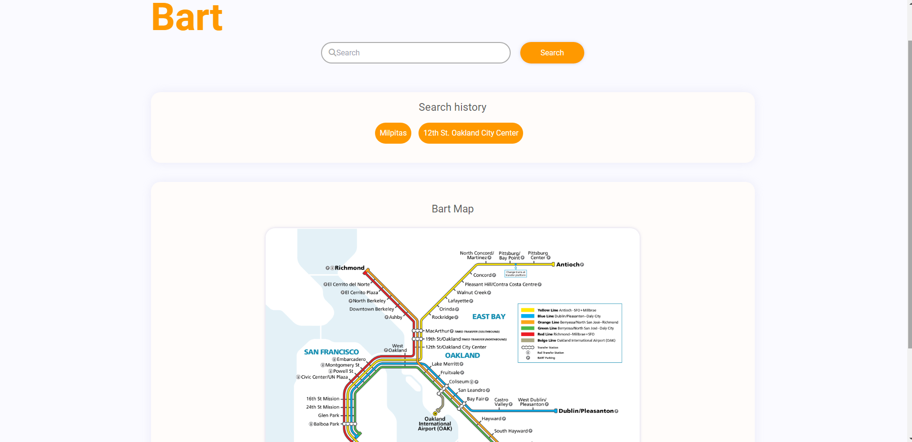

# newbieBay: The California Bay Area Guide

## Description

A handy, intuitive website that grants users a number of resources suited for life in California's bay area, utilizing multiple API calls to supplement  well-crafted HTML and CSS elements.

## Installation

First, [navigate to the site.](https://darxmarx.github.io/california-bay-area-guide/)
 
Then, click on the navigation links to check out the resources!

## Usage

Our group's website, newbieBay, is founded upon numerous profound questions many often ask upon finding themselves in the bay area of beautiful California: What's the weather like? How can I get around? What should I eat? Are there any jobs I can find? Instead of having to scour the world wide web, users can find the answers to all of these questions all within newbieBay. The landing page of newbieBay is meticulously designed to be warm and welcoming, utilizing a bright, cheery interface and intriguing them with the small variety of options at their disposal. Using the handy navigation bar, always found at the top of the page, users can check the Bay Area Rapid Transit District (BART) locations and departure times, quickly informing them of the public transport available. In addition, users may find themselves at the Restaurant tab, powered by Yelp Fusion, and quickly search up the top 12 best matches for restaurants based on user input. The Jobs link in the navigation bar tops off the site's features, granting access to Adzuna's API to search for jobs based on keyword and location. No more hassle to get essential data to life in the bay area--newbieBay has you covered!

## Screenshot

 
 "website bart demo")
 

## Credits

N/A

## License

Please refer to the LICENSE in the repo.